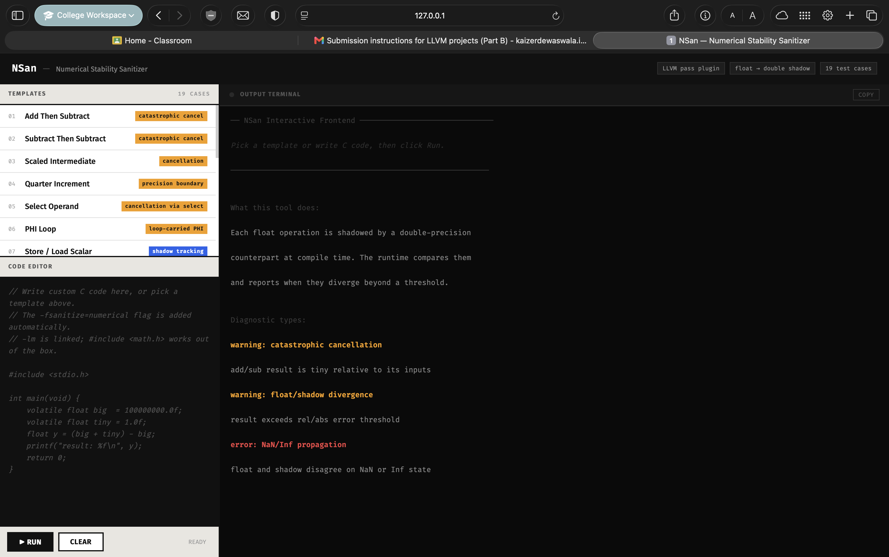
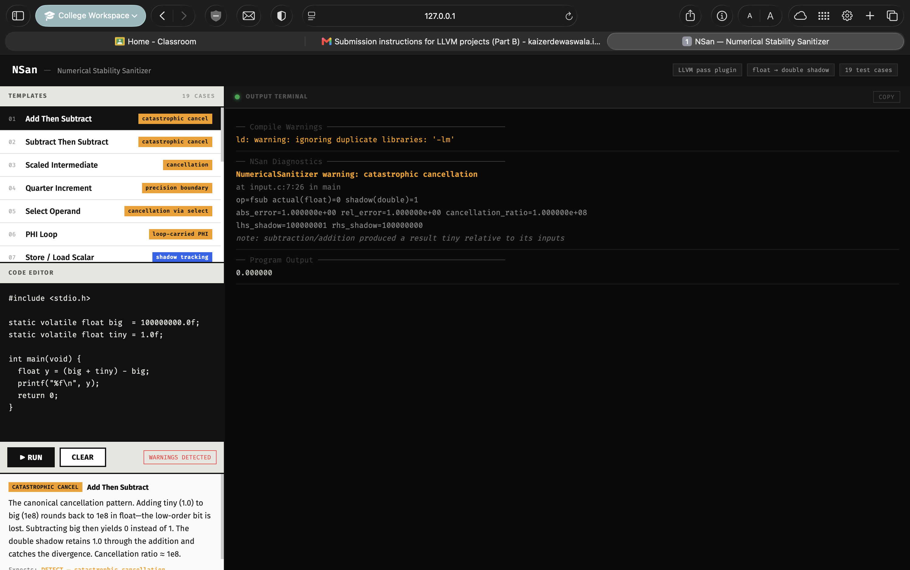
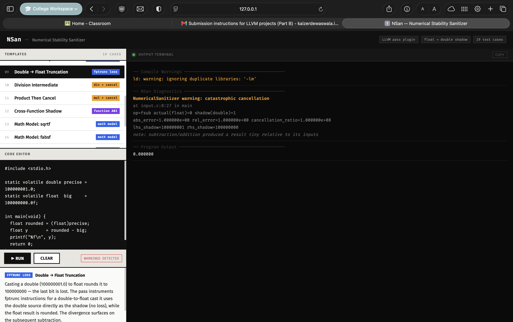

# NSan — Numerical Stability Sanitizer

An LLVM instrumentation pass and C runtime that tracks every `float` computation with a parallel `double` shadow value and reports when the two diverge beyond a configurable threshold, flagging catastrophic cancellation, general precision loss, and NaN/Inf mismatches.

## What It Does

The sanitizer intercepts every floating-point operation at compile time (via an LLVM pass plugin) and inserts shadow arithmetic in higher precision (`double`). At run time a small C library stores per-address shadow values and emits diagnostics when the shadow result disagrees with the actual `float` result. This surfaces numerical instabilities that are otherwise invisible to the programmer.

Detected conditions:
- **Catastrophic cancellation** — add/subtract result is tiny relative to its inputs and the float result diverges from the shadow
- **Float/shadow divergence** — general precision loss beyond configurable relative/absolute thresholds
- **NaN/Inf mismatch** — float and shadow disagree about whether a value is NaN or Inf

## Web UI

An interactive browser frontend lets you explore all 19 test cases and run custom C code live:

```bash
pip3 install flask
python3 web/app.py
# open http://127.0.0.1:5000
```

### Frontend overview



The left panel lists all 19 test cases with colour-coded tags. Clicking any template loads its source into the editor and shows a concise explanation of why it triggers (or doesn't trigger) the sanitizer.

### Running a test — full diagnostic output



Clicking **Run** compiles the code with `-fsanitize=numerical` and streams the real sanitizer output into the terminal panel. Warnings are highlighted in amber, source locations in grey, and detail lines (op, abs\_error, rel\_error, cancellation\_ratio) are shown below each diagnostic.

### Custom code and advanced test cases



The editor accepts any custom C code. The `-fsanitize=numerical` flag, `-O1`, and `-lm` are added automatically. The status bar shows `WARNINGS DETECTED` or `SUCCESS` after each run.

## Repository Layout

```
lib/          LLVM pass plugin (NumericalSanitizerPass.cpp)
runtime/      C runtime library (numerical_sanitizer_runtime.c)
include/      Public API header (NumericalSanitizer/NumericalSanitizer.h)
tools/        numerical-clang wrapper, nsan_dashboard.py
tests/cases/  19 test programs (cases 01–19)
benchmarks/   3 benchmark programs + run_benchmarks.py
examples/     Interactive terminal demo
web/          Browser frontend (Flask + single-page HTML)
docs/         Design notes, project report, screenshots
build.sh      One-command build
run.sh        One-command smoke test
```

## Requirements

- macOS or Linux
- [LLVM](https://llvm.org/) development package with CMake support (`LLVMConfig.cmake`, `clang`, `clang++`)
- CMake ≥ 3.20
- Python 3 (for the test runner, benchmarks, and web UI)

On macOS with Homebrew:

```bash
brew install llvm cmake python3
```

## Build

```bash
./build.sh
```

This runs CMake and compiles the pass plugin, runtime library, and `numerical-clang` wrapper into `build/`.

Manual equivalent:

```bash
cmake -S . -B build \
  -DLLVM_DIR=/opt/homebrew/opt/llvm/lib/cmake/llvm \
  -DCMAKE_PREFIX_PATH=/opt/homebrew/opt/llvm \
  -DCMAKE_C_COMPILER=/opt/homebrew/opt/llvm/bin/clang \
  -DCMAKE_CXX_COMPILER=/opt/homebrew/opt/llvm/bin/clang++
cmake --build build
```

## Run

```bash
./run.sh
```

Compiles and runs the canonical catastrophic-cancellation example, runs all 19 test cases, then prints the benchmark overhead table (quick mode, ~20 seconds).

### Compile any C file

```bash
build/numerical-clang -fsanitize=numerical -O1 -g yourfile.c -o yourfile
./yourfile
```

### Interactive terminal demo

```bash
build/numerical-clang -fsanitize=numerical -O1 -g examples/terminal_input.c -o /tmp/nsan_demo
/tmp/nsan_demo
```

Enter `100000000 1` to trigger a catastrophic cancellation warning.

### JSON output

```bash
NSAN_REPORT_FORMAT=json /tmp/nsan_demo
```

### Terminal dashboard

```bash
python3 tools/nsan_dashboard.py
```

### Full test suite

```bash
python3 tests/run_tests.py --clang build/numerical-clang
```

### Benchmarks

```bash
python3 benchmarks/run_benchmarks.py --clang build/numerical-clang --iterations 3
```

## Benchmark Results

Measured on macOS arm64 with Homebrew LLVM 22.1.4:

| Program | Baseline | Instrumented | Overhead |
|---|---:|---:|---:|
| `dot_product.c` | 0.005989 s | 0.226089 s | 37.75× |
| `harmonic.c` | 0.011756 s | 0.449429 s | 38.23× |
| `matmul.c` | 0.008148 s | 0.041147 s | 5.05× |

Overhead is expected for a shadow-value sanitizer. It is significantly lower than Valgrind-style binary instrumentation tools (Herbgrind: 100–1000×).

## Runtime Tuning

All thresholds are controlled via environment variables at run time:

| Variable | Default | Meaning |
|---|---|---|
| `NSAN_REL_ERROR` | `1e-5` | Relative error threshold for divergence |
| `NSAN_ABS_ERROR` | `1e-12` | Absolute error threshold |
| `NSAN_CANCELLATION_RATIO` | `1e6` | Input/result magnitude ratio for catastrophic cancellation |
| `NSAN_HALT_ON_ERROR` | `0` | Set to `1` to abort on first diagnostic |
| `NSAN_REPORT_LOADS` | `0` | Set to `1` to include load-site divergences |
| `NSAN_REPORT_CALLS` | `0` | Set to `1` to include call-return divergences |
| `NSAN_REPORT_FORMAT` | text | Set to `json` for machine-readable output |
| `NSAN_DEBUG_MEMORY` | `0` | Set to `1` to trace shadow-memory operations |

## Further Reading

- [DESIGN.md](DESIGN.md) — design approach and alternatives considered
- [IMPLEMENTATION.md](IMPLEMENTATION.md) — LLVM pass and runtime implementation details
- [EVALUATION.md](EVALUATION.md) — test cases, benchmark results, and baseline comparison
- [docs/project_report.md](docs/project_report.md) — full project report
