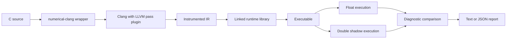

# Numerical Stability Sanitizer Project Report

## 1. Assignment Context

This project was built for the assignment:

> Numerical Stability Sanitizer  
> An LLVM instrumentation pass plus runtime that maintains higher-precision shadow values alongside float operations and flags precision loss when it exceeds a threshold.

The original motivation is that mainstream production compilers do not currently ship a dedicated sanitizer for numerical instability. Existing research systems such as Herbgrind demonstrated that dynamic floating-point error tracking is feasible, but they are typically heavy, unmaintained, or not designed for compiler-integrated workflows.

## 2. What Was Asked

The assignment requested:

1. An LLVM instrumentation pass inserting shadow-value computations for float ops
2. A runtime library managing shadow storage and reporting divergences
3. Clang flag wiring for `-fsanitize=numerical`
4. Ten or more test cases with known numerical issues
5. A performance comparison on three programs

The minimum viable scope was explicitly limited to:

- `float` operations only
- `double` as the shadow type
- catastrophic cancellation detection only

## 3. What We Implemented

The current repository goes beyond the minimum viable scope while staying within a prototype-friendly design.

Implemented features:

- LLVM new-pass-manager instrumentation plugin
- Runtime library for float shadow storage and diagnostics
- `-fsanitize=numerical` user flow through a wrapper script
- Scalar `float` shadowing with `double`
- Fixed-width vector float shadowing with per-lane diagnostics
- Shadow propagation through direct instrumented function calls
- Prototype float return shadow propagation
- Float math-call shadow models for common functions
- Human-readable diagnostics and JSON diagnostics
- Interactive terminal demo
- Nineteen runnable numerical test cases
- Three benchmark programs with overhead reporting

## 4. Repository Structure

Key files:

- [lib/NumericalSanitizerPass.cpp](/Users/kaizerdewaswala/Documents/New%20project/lib/NumericalSanitizerPass.cpp)
- [runtime/numerical_sanitizer_runtime.c](/Users/kaizerdewaswala/Documents/New%20project/runtime/numerical_sanitizer_runtime.c)
- [include/NumericalSanitizer/NumericalSanitizer.h](/Users/kaizerdewaswala/Documents/New%20project/include/NumericalSanitizer/NumericalSanitizer.h)
- [tools/numerical-clang.in](/Users/kaizerdewaswala/Documents/New%20project/tools/numerical-clang.in)
- [tools/nsan_dashboard.py](/Users/kaizerdewaswala/Documents/New%20project/tools/nsan_dashboard.py)
- [examples/terminal_input.c](/Users/kaizerdewaswala/Documents/New%20project/examples/terminal_input.c)
- [tests/cases](/Users/kaizerdewaswala/Documents/New%20project/tests/cases)
- [benchmarks](/Users/kaizerdewaswala/Documents/New%20project/benchmarks)

## 5. System Architecture



## 6. Instrumentation Strategy

### 6.1 Scalar Floats

For each scalar `float` SSA value, the pass creates a parallel `double` shadow value.

Example idea:

```c
float z = x + y;
```

becomes conceptually:

```c
float z = x + y;
double z_shadow = x_shadow + y_shadow;
check(z, z_shadow);
```

### 6.2 Fixed-Width Vectors

For a fixed-width vector such as `<4 x float>`, the pass creates a `<4 x double>` shadow and performs per-lane checking. This is intentionally lane-based so the existing scalar runtime can still report useful diagnostics.

### 6.3 Memory Operations

For float stores:

- the runtime stores the current shadow in a shadow table keyed by address

For float loads:

- the runtime looks up the shadow by address
- if no shadow exists, it falls back to `(double)actual`

Vector loads and stores are lowered to per-lane shadow memory operations.

The current code also instruments:

- `llvm.memcpy`
- `llvm.memmove`
- `llvm.memset`
- direct libc calls to `memcpy`, `memmove`, and `memset`

For copy and move operations, the runtime transfers shadow information for fully covered float-sized regions. For `memset`, the runtime conservatively invalidates overlapping shadow entries so stale shadow state does not survive raw byte writes.

### 6.4 Function Calls

The current code includes a prototype interprocedural shadow propagation scheme:

- caller places float argument shadows into thread-local argument slots
- instrumented callee reads those slots at function entry
- instrumented callee publishes float return shadow into a thread-local return slot
- caller consumes the return shadow after the call

This works well for direct instrumented calls in a prototype setting, but it is not a production ABI.

## 7. Runtime Design

The runtime handles:

- shadow-memory lookup and update
- configurable thresholds
- duplicate-report suppression
- human-readable and JSON diagnostics
- a thread-safe shadow/report table design using C11 spin locks

Environment variables:

- `NSAN_REL_ERROR`
- `NSAN_ABS_ERROR`
- `NSAN_CANCELLATION_RATIO`
- `NSAN_HALT_ON_ERROR`
- `NSAN_REPORT_LOADS`
- `NSAN_REPORT_CALLS`
- `NSAN_REPORT_FORMAT=json`
- `NSAN_DEBUG_MEMORY=1`

## 8. Detection Model

Current detection focus:

- catastrophic cancellation
- general float/shadow divergence
- NaN/Inf mismatch

Catastrophic cancellation is reported when:

- the operation is `fadd` or `fsub`
- the float result diverges from the shadow result
- the result is tiny relative to the input magnitudes

This is intentionally simpler than full significance tracking.

## 9. Math Function Modeling

The runtime includes shadow implementations for:

- `sqrtf`
- `sinf`
- `cosf`
- `tanf`
- `expf`
- `logf`
- `powf`
- `fabsf`
- `floorf`
- `ceilf`
- `fmodf`
- `atanf`
- `atan2f`
- `asinf`
- `acosf`
- `sinhf`
- `coshf`

The pass also recognizes several LLVM float intrinsics such as `llvm.sqrt.f32`.

## 10. Build Instructions

### macOS with Homebrew LLVM

```bash
brew install llvm
cmake -S . -B build \
  -DLLVM_DIR=/opt/homebrew/opt/llvm/lib/cmake/llvm \
  -DCMAKE_PREFIX_PATH=/opt/homebrew/opt/llvm \
  -DCMAKE_C_COMPILER=/opt/homebrew/opt/llvm/bin/clang \
  -DCMAKE_CXX_COMPILER=/opt/homebrew/opt/llvm/bin/clang++
cmake --build build
```

## 11. How To Run

### Basic interactive demo

```bash
build/numerical-clang -fsanitize=numerical -g examples/terminal_input.c -o /tmp/nsan_terminal
/tmp/nsan_terminal
```

Example input:

```text
100000000 1
```

### JSON demo

```bash
NSAN_REPORT_FORMAT=json /tmp/nsan_terminal
```

### Run one test manually

```bash
build/numerical-clang -fsanitize=numerical -g tests/cases/12_function_shadow_abi.c -o /tmp/nsan_fn
/tmp/nsan_fn
```

### Run the full test suite

```bash
python3 tests/run_tests.py --clang build/numerical-clang
```

### Run benchmarks

```bash
python3 benchmarks/run_benchmarks.py --clang build/numerical-clang --iterations 3
```

### Run the presentation dashboard

```bash
python3 tools/nsan_dashboard.py
```

## 12. Example Demo Cases

### 12.1 Catastrophic cancellation

File:

- [tests/cases/01_add_then_subtract.c](/Users/kaizerdewaswala/Documents/New%20project/tests/cases/01_add_then_subtract.c)

Pattern:

```c
float y = (big + tiny) - big;
```

Expected effect:

- float loses the low-order increment
- double shadow preserves it
- sanitizer reports catastrophic cancellation

### 12.2 Function-call shadow ABI

File:

- [tests/cases/12_function_shadow_abi.c](/Users/kaizerdewaswala/Documents/New%20project/tests/cases/12_function_shadow_abi.c)

Purpose:

- demonstrates shadow propagation across a direct function call

### 12.3 Math-model demo

File:

- [tests/cases/13_libm_sqrt_shadow.c](/Users/kaizerdewaswala/Documents/New%20project/tests/cases/13_libm_sqrt_shadow.c)

Purpose:

- shows that float math calls can preserve a higher-precision shadow path

### 12.4 Vector demo

File:

- [tests/cases/15_vector_float_ops.c](/Users/kaizerdewaswala/Documents/New%20project/tests/cases/15_vector_float_ops.c)

Purpose:

- demonstrates per-lane vector checking for fixed-width float vectors

## 13. Testing Status

Current test inventory:

- 17 positive-detection cases
- 2 negative correctness cases (`memset` invalidation and integer-store invalidation should not report stale-shadow noise)
- full `ctest` integration
- benchmark runner for 3 programs

These tests cover:

- scalar arithmetic cancellation
- PHIs and loop-carried values
- stores and reloads
- truncation
- direct function-call shadow propagation
- math models
- fixed-width vectors
- raw memory transfer/invalidation paths

## 14. Benchmark Status

Current benchmark set:

- dot product
- harmonic sum
- matrix multiply

Recent measured overheads on this machine:

| Program | Baseline | Instrumented | Overhead |
| --- | ---: | ---: | ---: |
| `dot_product.c` | 0.005989s | 0.226089s | 37.75x |
| `harmonic.c` | 0.011756s | 0.449429s | 38.23x |
| `matmul.c` | 0.008148s | 0.041147s | 5.05x |

Interpretation:

- this is much slower than normal execution, as expected for dynamic checking
- it is still realistic enough for a prototype presentation
- the overhead is lower than heavyweight Valgrind-style dynamic systems

## 15. Presentation Plan

Suggested live flow:

1. Show the problem with `(big + tiny) - big`
2. Run the terminal dashboard
3. Show the interactive demo in text mode
4. Show JSON mode briefly
5. Run one curated test case for function-call shadow propagation
6. Mention vector support and math models
7. Show benchmark table
8. Close with limitations and future work

## 16. Limitations

Important honesty points:

- `-fsanitize=numerical` is exposed through a wrapper, not through a patched upstream Clang driver
- the function-call ABI is prototype-level
- vector support is fixed-width only, not scalable-vector support
- shadow memory is still object-oriented rather than fully byte-addressable, even though common raw-memory operations are now handled
- this is not MPFR-backed
- the detector is not yet full significance tracking

## 17. Future Work

The major production-grade directions are:

- true Clang driver integration
- scalable vectors
- ABI-compatible shadow propagation across separate compilation, indirect calls, varargs, and mixed instrumented/uninstrumented objects
- byte-addressable shadow memory
- MPFR or stronger high-precision backends
- full significance tracking and richer root-cause ranking

## 18. Final Assessment

This repository currently satisfies the original assignment well and includes meaningful extensions beyond the minimum requested scope. It is best described as:

> a working LLVM-based numerical instability sanitizer prototype with runtime shadow tracking, direct interprocedural shadow propagation, vector support, math-call models, tests, benchmarks, and presentation tooling

That is a strong position for a project demo or lab presentation.
